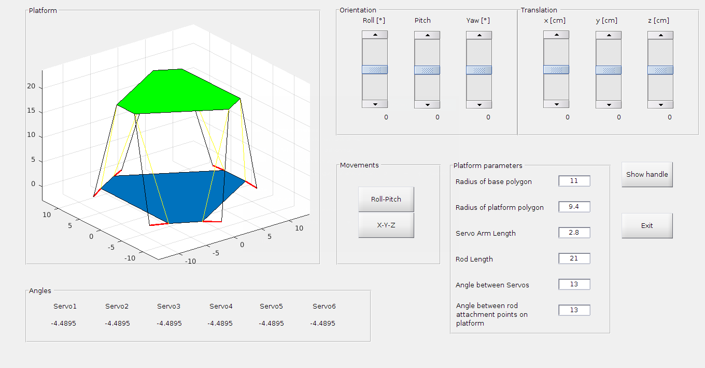

# Stewart_Platform

A complete Stewart Platform control system, including:

- 🧮 MATLAB-based simulation and GUI visualization
- 🧠 Real-time embedded control code for STM32F407 microcontroller

This project enables both virtual modeling and actual hardware control of a six-degree-of-freedom (6-DoF) Stewart platform.

---

## 📌 项目简介

斯图尔特平台（Stewart Platform）是一种六自由度并联机构，广泛应用于飞行模拟、精密加工、机器人控制等领域。本项目完整实现了 Stewart 平台的 **仿真建模** 与 **嵌入式控制系统**：

- MATLAB 模拟与 GUI 界面：便于直观控制、参数调试和姿态仿真  
- STM32 嵌入式控制代码：通过串口或 PWM 驱动真实平台执行运动指令

---

## 🧩 目录结构

```
Stewart_Platform/
├── stewart_platform.m           # MATLAB 主函数（仿真 + GUI）
├── stewart_platform.fig         # GUI 控制面板文件
├── stewart_platform_gui.png     # 控制界面预览图
├── test.m                       # MATLAB 测试脚本
├── Stewart/                     # 🔧 嵌入式控制源码（STM32F407）
│   ├── Core/                    # 主控逻辑（main.c, main.h 等）
│   ├── Drivers/                 # STM32 HAL 驱动库
│   ├── Inc/                     # 头文件
│   ├── Src/                     # C 源码
│   └── ...                      # 其他配置文件（.ioc, startup 等）
└── .gitignore
```

---

## 🖥️ MATLAB 模拟部分

### 依赖环境

- MATLAB R2020a 或以上版本  

### GUI 界面预览



---

## 🔧 嵌入式控制（STM32F407）

本项目使用 STM32F407 微控制器，配合 PWM 输出和串口通信，实现对平台舵机/电机的控制。

### 工程说明

- 使用 STM32CubeMX 工具生成工程（含 `.ioc` 文件）
- 使用 HAL 驱动框架

### 开发环境

- STM32CubeIDE 或 Keil MDK（建议使用 CubeIDE）

### 快速开始

1. 使用 STM32CubeIDE 打开 `Stewart/` 目录下的项目文件
2. 编译并下载至 F407 板
3. 确保平台电源与执行机构已连接

## 🙌 贡献方式

欢迎参与改进本项目：

- 补充运动学/动力学求解
- 丰富 GUI 控制功能
- 优化 STM32 控制代码结构
- 增加多平台支持
感谢使用 **Stewart_Platform** 项目！✨
